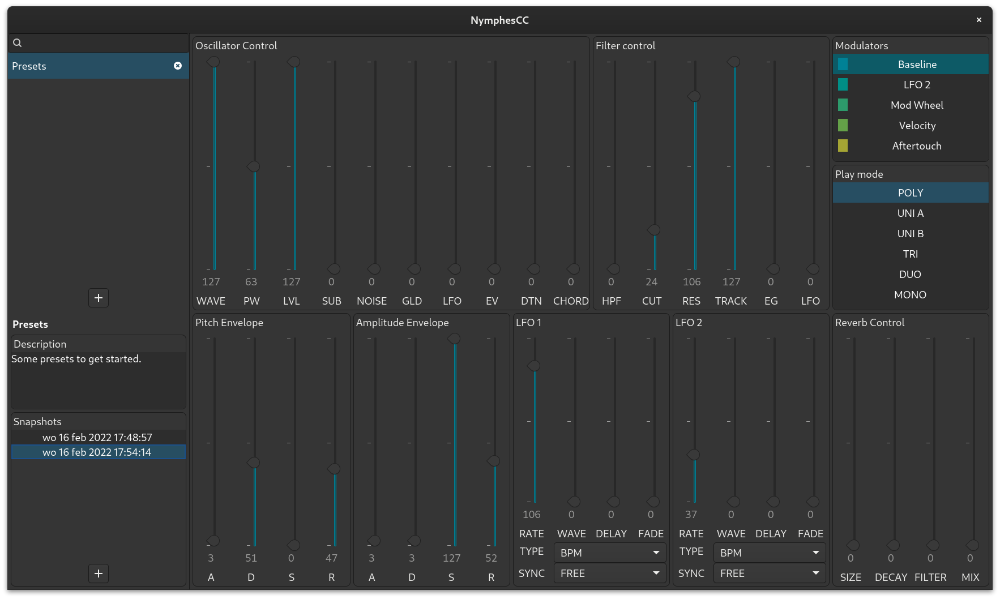

``` {.python file=nymphescc/__init__.py}
__version__ = "0.1.0"
```

This is an **experimental** controller for the Dreadbox Nymphes 6-voice analog synthesizer. This synthesizer is very versatile, but its many options are hidden behind a complicated menu system.

The controller in this package solves this issue. The interface is still **modal** (like the physical sliders on the Nymphes), just less complicated: a list box on the right shows if you're tweaking the main settings or one of the modulation sources (LFO, mod-wheel, velocity or aftertouch). Each modulation source is indicated with a different color.



NymphesCC is currently only implemented for Linux, using Python and **Gtk**. There is in principle nothing stopping it from working on Windows or MacOS, except that I have no means of testing it on those platforms. NymphesCC communicates with the Nymphes device through **ALSA** (using the [alsa-midi](https://github.com/Jajcus/python-alsa-midi.git) Python package).

There is a rudimentary implementation of a session manager that allows you to store and load settings. These sessions are stored in a Sqlite database in `~/.config/nymphescc/patches.db`.

## Requirements

- Python &ge;3.10
- Gtk 4
- A [Dreadbox Nymphes](https://www.dreadbox-fx.com/nymphes/) attached.

## Install NymphesCC
Clone this repository and run `pip install --user .`, or use `poetry install` to install inside virtual env. This should install the `nymphescc` executable in your path.

## Updating Firmware
It may take some searching online to figure out how to update firmware from Linux. You probably have all the right tools already installed (on Fedora the package is called `alsa-utils`)! First, disconnect the Nymphes, press the `menu` and `load` buttons simultaniously while plugging the Nymphes back in: the `shift` `load` and `menu` buttons should light up in sequence. Figure out on what port the Nymphes is available on your PC:

```shell
amidi -l
```

In my case, I get to see the Nymphes, my Arturia keyboard and my Behringer USB soundcard:

```
Dir Device    Name
IO  hw:0,0,0  Nymphes MIDI 1
IO  hw:4,0,0  Arturia KeyStep 32 MIDI 1
IO  hw:5,0,0  UMC204HD 192k MIDI 1
```

Then send the firmware to the Nymphes, either to port `hw:0,0,0` (in this case), or use the alias `hw:Nymphes`:

```shell
amidi -p hw:Nymphes -s nymphes_v2.syx
```

After the firmware is loaded, Nymphes will start auto-tuning and you're ready to go.


## TODO

- [x] Firmware 2.0 support (1.0 no longer works)
- [x] Auto-connect to Nymphes 
- [ ] Decode Sysex messages
- [ ] Add MIDI-through support
- [ ] Export patches to MIDI files (you can do this using sqlite, but that is not so nice from a UI point of view).
- [ ] Use Base2048 to share patches through Twitter.
- [ ] Add button to explicitely sync setting with device.
- [ ] Add status to show if we're connected with device.
- [ ] Add name metadata to snapshots.
- [ ] Add delete button to snapshots.
- [ ] Implement search bar

## Contributing
If you'd like to contribute to this project, please checkout the contribution guide lines in `CONTRIBUTING.md`.

## License
>   Copyright 2022 Johan Hidding
>
>   Licensed under the Apache License, Version 2.0 (the "License");
>   you may not use this file except in compliance with the License.
>   You may obtain a copy of the License at
>
>       http://www.apache.org/licenses/LICENSE-2.0
>
>   Unless required by applicable law or agreed to in writing, software
>   distributed under the License is distributed on an "AS IS" BASIS,
>   WITHOUT WARRANTIES OR CONDITIONS OF ANY KIND, either express or implied.
>   See the License for the specific language governing permissions and
>   limitations under the License.
